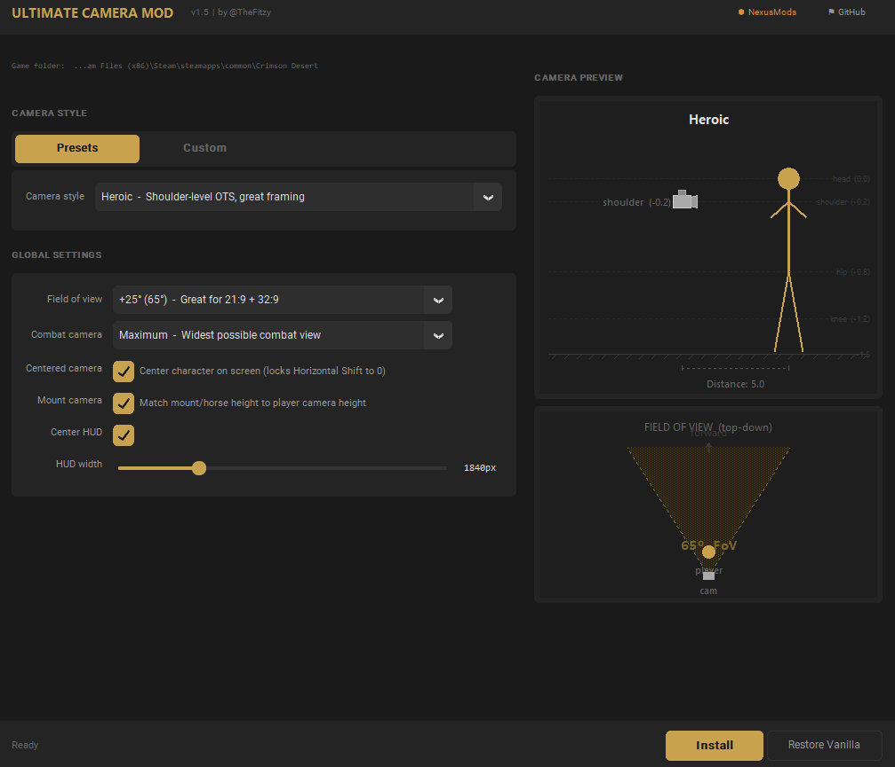
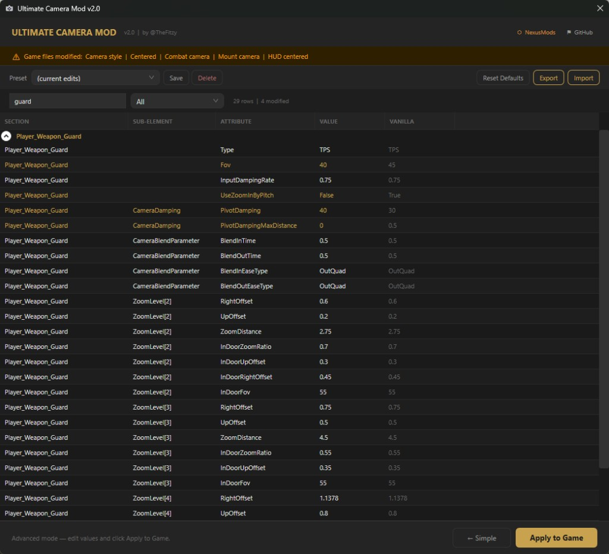
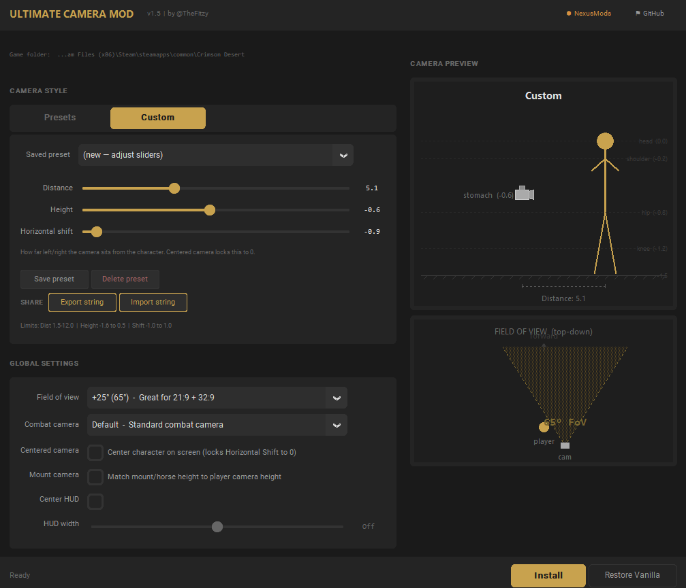

# Ultimate Camera Mod — Crimson Desert

Standalone camera toolkit for Crimson Desert with a full GUI, live camera preview, advanced XML editor, and HUD centering for ultrawide displays.

[](https://github.com/FitzDegenhub/UltimateCameraMod/releases/latest)
[](https://www.nexusmods.com/crimsondesert/mods/438)
[](https://www.virustotal.com/gui/file-analysis/NDFkN2U3M2U5ZjA2ZDI4Mzc4ZjE1MDVkZjFhNTgwNzg6MTc3NDk1Mjg0Mw==)
[](LICENSE)



## Features

### Simple Mode
- **8 Camera Presets** with live preview — Panoramic, Heroic, Vanilla, Close-Up, Low Rider, Knee Cam, Dirt Cam, Survival
- **Custom Camera** — Slider control over distance, height, and horizontal shift (-1 to +1). Save unlimited named presets, share via import/export codes (`UCM:` strings)
- **Field of View** — Adjustable from vanilla 40° up to 80°, with universal FoV consistency across all camera states (guard, aim, mount, glide, cinematic) to eliminate jarring transitions
- **Centered Camera** — Character dead center, eliminating the left-offset shoulder cam across 150+ camera states
- **Combat Camera** — Three lock-on zoom levels: Default, Wider, Maximum
- **Mount Camera Sync** — Mount cameras match your chosen player camera height
- **Extra Zoom Levels** — Two additional zoom-out levels (ZL5 + ZL6) on foot and mounted. Scroll further out than vanilla allows
- **Horse First Person (Experimental)** — First-person camera while mounted. Scroll all the way in to see through your character's eyes. Works well at walk/trot; may clip during dashes
- **Skill Aiming Side-Consistency** — Lantern, Blinding Flash, Bow, and all aim/zoom skills respect your horizontal shift setting. The camera no longer snaps to the opposite side when activating abilities
- **Steadycam Smoothing** — Completely revamped camera smoothing system. Normalizes blend timing and FOV across all movement states (idle, walk, run, sprint, combat, guard, mount) to eliminate the jarring zoom-in/zoom-out transitions the vanilla game applies when switching between states. The game has over 150 camera states, each with independent FOV, blend time, and damping values that cause the camera to constantly bob, sway, and shift. Steadycam sets consistent values across these states so the camera feels stable and predictable. This is an ongoing community effort — the sheer number of camera parameters means there's always room for improvement, and the Advanced Editor lets anyone fine-tune it further.
- **HUD Centering** — Adjustable width slider (1200–3840px) to constrain HUD elements for ultrawide. *Currently disabled — a recent game update added integrity checks that trigger a Coherent Gameface watermark. Controls will be re-enabled once a workaround is found.*
- **Update Notifications** — Automatically checks GitHub releases on launch and shows a banner when a new version is available

### Advanced Editor



- **Full XML Editor** — Every player camera parameter exposed in a searchable, filterable DataGrid
- **Vanilla Comparison** — Side-by-side vanilla vs. modified values; modified fields highlighted in gold
- **Grouped by Camera State** — Collapsible sections (Player_Basic_Default, Player_Weapon_Guard, etc.)
- **Save/Load/Delete** named advanced presets
- **Import/Export** advanced configurations as shareable strings (`UCM_ADV:` prefix, distinct from simple presets)
- **Import XML** — Load a `playercamerapreset.xml` file from other mods and merge the values into the editor
- **Expand/Collapse All** — One-click toggle to expand or collapse all section groups
- **Reset to Defaults** — One click to revert all advanced changes

### Quality of Life
- **Auto Game Detection** — Finds Crimson Desert across Steam, Epic Games, and Xbox/Game Pass
- **Automatic Backup** — Creates a vanilla backup before any modification; one-click restore
- **Mod-Active Detection** — Reads live game files to show which modifications are currently installed
- **Settings Persistence** — All selections remembered between sessions
- **Portable** — Single `.exe`, no installer required



## How It Works

1. Locates the game's PAZ archive containing `playercamerapreset.xml`
2. Creates a backup of the original file (only once — never overwrites a clean backup)
3. Decrypts the archive entry (ChaCha20 + Jenkins hash key derivation)
4. Decompresses via LZ4
5. Parses and modifies the XML camera parameters based on your selections
6. Re-compresses, re-encrypts, and writes the modified entry back into the archive

HUD modifications follow the same pipeline for `ui/minimaphudview2.html`, `ui/statusgaugeview2.html`, and `ui/gamecommon.css` in archive `0012`.

No DLL injection, no memory hacking, no internet connection required — pure data file modification.

## Building from Source

Requires [.NET 6 SDK](https://dotnet.microsoft.com/download/dotnet/6.0) (or later).

```bash
cd src/UltimateCameraMod
dotnet publish -c Release -r win-x64 --self-contained -p:PublishSingleFile=true -p:EnableCompressionInSingleFile=true -p:IncludeNativeLibrariesForSelfExtract=true
```

The compiled exe will be in `bin/Release/net6.0-windows/win-x64/publish/`.

Or run directly without compiling:

```bash
cd src/UltimateCameraMod
dotnet run
```

### Dependencies (NuGet, restored automatically)

- [K4os.Compression.LZ4](https://www.nuget.org/packages/K4os.Compression.LZ4/) — LZ4 block compression/decompression

## Project Structure

```
src/UltimateCameraMod/
├── Controls/           # WPF custom controls (camera preview, FOV preview)
├── Models/             # Data models (AdvancedRow, CameraRules, PresetCodec)
├── Paz/                # PAZ archive handling (ChaCha20, LZ4, Jenkins hash, PAMT parsing)
├── Services/           # Core logic (CameraMod, GameDetector, HudMod)
├── MainWindow.xaml     # Main application UI (Simple + Advanced modes)
├── App.xaml            # Application resources and dark theme
└── UltimateCameraMod.csproj
```

## Community & Sharing

> **Nobody has perfected Crimson Desert's camera yet — and that's the point.**
>
> The vanilla game has over 150 camera states, each with dozens of parameters controlling distance, FOV, blend timing, damping, offsets, and more. No single developer can tune all of that for every playstyle and display setup. That's why UCM was built with sharing at its core.
>
> Every setting you tweak — whether it's a simple preset or a deep Advanced Editor override — can be exported as a string and shared with other players. If someone in the community figures out the perfect guard-camera transition, or nails the combat FOV for ultrawide, they can share it in seconds and everyone benefits.
>
> **This already works.** The guard-camera zoom snap that plagued the vanilla game was solved by a single user adjusting one FOV value in the Advanced Editor. That kind of community-driven fine-tuning is exactly what this tool is for.

### Preset Formats

UCM uses two string formats so they can't be mixed up:

| Format | Used in | Contains |
|--------|---------|----------|
| `UCM:...` | Custom tab → Export/Import | Distance, height, horizontal shift |
| `UCM_ADV:...` | Advanced editor → Export/Import | Full XML parameter overrides |

Export your config, post it on Nexus/Discord/Reddit, and others can import it in one click. The more people tweak, the better it gets for everyone.

## Compatibility

- **Platforms:** Steam, Epic Games, Xbox / Game Pass
- **OS:** Windows 10/11 (x64)
- **Display:** Any aspect ratio — 16:9, 21:9, 32:9

## FAQ

**Will this get me banned?**
UCM modifies offline data files only. It does not touch game memory, inject code, or interact with running processes. Use at your own discretion in online/multiplayer modes.

**The game updated and my camera is back to vanilla.**
Normal — game updates overwrite modded files. Re-open UCM and click Install. Your settings are saved automatically.

**My antivirus flagged the exe.**
Known false positive with self-contained .NET apps. [VirusTotal scan is clean](https://www.virustotal.com/gui/file-analysis/NDFkN2U3M2U5ZjA2ZDI4Mzc4ZjE1MDVkZjFhNTgwNzg6MTc3NDk1Mjg0Mw==). Full source is available here to review and build yourself.

## Version History

- **v2.2** — Major feature release. Added Steadycam toggle (revamped smoothing system), Extra Zoom Levels, Horse First Person (experimental), Horizontal Shift slider, universal FoV consistency across all camera states, skill aiming side-consistency (Lantern/Blinding Flash/Bow respect your camera side), Import XML in Advanced Editor, preset sharing via copy-paste codes, update notifications, Expand/Collapse All in Advanced Editor. Fixed horizontal shift direction, Reset Defaults crash, guard release zoom snap, horse mount camera jolt, extra zoom on horseback, Advanced Editor stability and performance. HUD centering temporarily disabled due to game update integrity checks.
- **v2.1** — Fixed custom preset sliders not writing InDoorUpOffset and RightOffset to all zoom levels.
- **v2.0** — Complete rewrite from Python to C# / .NET 6 / WPF. Advanced XML editor, preset management, import/export, auto game detection for Steam/Epic/Xbox, settings persistence, mod-active detection.
- **v1.5** — Python version with customtkinter GUI, camera presets, custom sliders, FOV control, HUD centering.

## Credits & Acknowledgements

- **0xFitz** — UCM development, camera tuning, advanced editor, ultrawide HUD support

### C# Rewrite (v2.0)
- **[MrIkso](https://github.com/MrIkso/CrimsonDesertTools)** — CrimsonDesertTools — C# PAZ/PAMT parser, ChaCha20 encryption, LZ4 compression, PaChecksum, archive repacker (.NET 8, MIT)
- **[mcraiha](https://github.com/mcraiha/CSharp-ChaCha20-NetStandard)** — Pure C# ChaCha20 stream cipher implementation used inside CrimsonDesertTools (BSD)
- **[MrIkso on Reshax](https://reshax.com/topic/18908-need-help-extracting-paz-pamt-files-from-crimson-desert-blackspace-engine/page/2/?&_rid=3118#findComment-103796)** — PAZ repacking guide: 16-byte alignment, PAMT checksum (skip first 12 bytes), PAPGT root index patching

### Original Python Version (v1.5)
- **[lazorr410](https://github.com/lazorr410/crimson-desert-unpacker)** — crimson-desert-unpacker — PAZ archive tooling, decryption research
- **@Maszradine** — CDCamera — Camera rules, steadycam system, style presets
- **@manymanecki** — CrimsonCamera — Dynamic PAZ modification architecture

## License

MIT
