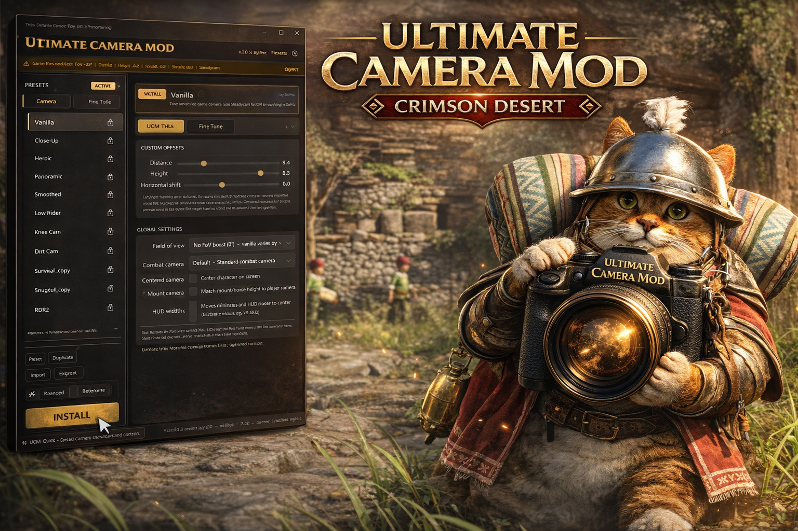
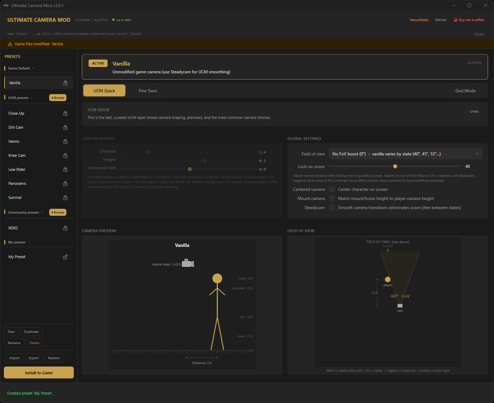
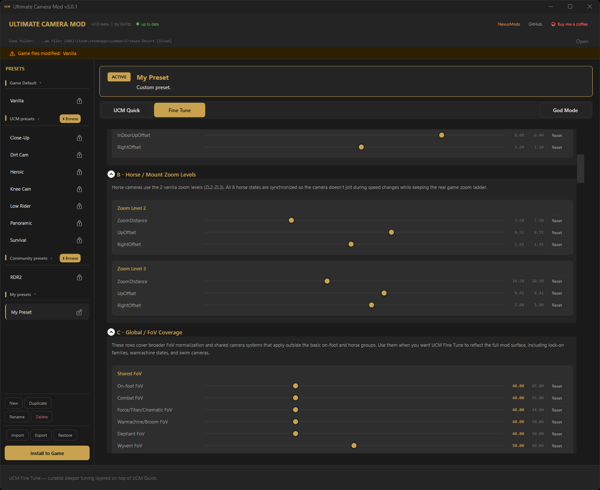
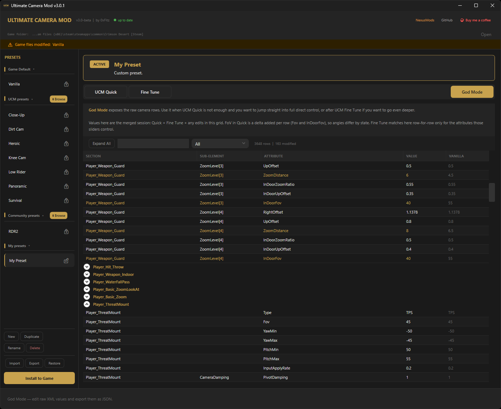
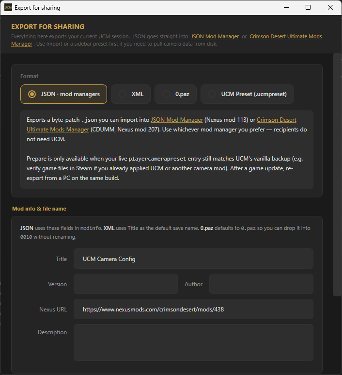
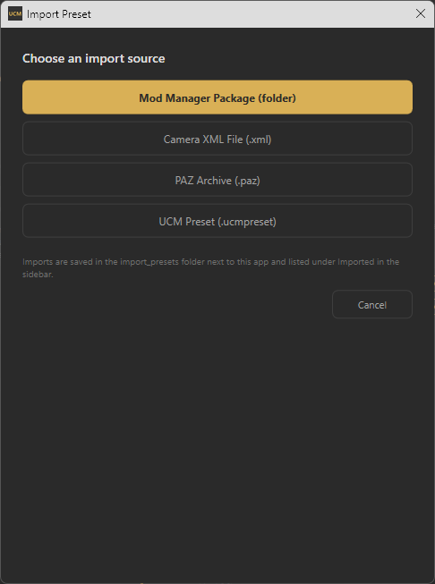

[English](../../README.md) | [한국어](README.ko.md) | [日本語](README.ja.md) | [简体中文](README.zh-CN.md) | [繁體中文](README.zh-Hant.md) | [ไทย](README.th.md) | [Bahasa Indonesia](README.id.md) | [Türkçe](README.tr.md) | [Polski](README.pl.md) | [Italiano](README.it.md) | [Svenska](README.sv.md) | [Norsk](README.nb.md) | [Dansk](README.da.md) | **Suomi** | [Deutsch](README.de.md) | [Français](README.fr.md) | [Español](README.es.md) | [Português (BR)](README.pt-BR.md) | [Русский](README.ru.md)

---

> **v3.1.2 on julkaistu!** Sacred God Mode -ohitukset, Lock-on Auto-Rotate -kytkin ja kaikki bugikorjaukset. Lataa **[GitHub Releases](https://github.com/FitzDegenhub/UltimateCameraMod/releases/latest)** -sivulta tai **[Nexus Modsista](https://www.nexusmods.com/crimsondesert/mods/438)**.

# Ultimate Camera Mod - Crimson Desert

Itsenäinen kameratyökalupaketti Crimson Desertiin. Täysi graafinen käyttöliittymä, reaaliaikainen kameraesikatselu, kolme muokkaustasoa, tiedostopohjainen preset-järjestelmä, **JSON-vienti [JSON Mod Managerille](https://www.nexusmods.com/crimsondesert/mods/113)** ja **[Crimson Desert Ultimate Mods Managerille](https://www.nexusmods.com/crimsondesert/mods/207)** (CDUMM) sekä ultralaajakuva-HUD-tuki.

<p align="center">
  
</p>

<p align="center">

[](https://github.com/FitzDegenhub/UltimateCameraMod/releases/tag/v3.1.2)
[](https://www.nexusmods.com/crimsondesert/mods/438)
[](https://github.com/FitzDegenhub/UltimateCameraMod/wiki)

[](https://www.virustotal.com/gui/file/7c5ddbfce28cabecb799a00b87ad4c4641c30c9db65cd2560c6a91d578852021)
[](https://www.reddit.com/r/CrimsonDesert/comments/1sfou61/ucm_ultimate_camera_mod_v3_crimson_desert_full/)
[](LICENSE)
[](https://ko-fi.com/0xfitz)

</p>

> Tarvitsetko apua? Tutustu **[Wikiin](https://github.com/FitzDegenhub/UltimateCameraMod/wiki)** -- sielta loydat asennusohjeet, kamera-asetusten selitykset, preset-hallinnan, vianmaarityksen ja kehittajadokumentaation.

---

<details>
<summary><strong>Kuvakaappaukset (v3.x)</strong> -- laajenna napsauttamalla</summary>
<br>

**UCM Quick** -- etaisyys, korkeus, siirto, FoV, lukituszoomi, steadycam, reaaliaikaiset esikatselut


**Fine Tune** -- kuratoitu syvasaato haettavilla reunustetuilla korteilla


**God Mode** -- taydellinen raaka-XML-editori vertailulla alkuperaisiin arvoihin


**JSON-vienti** -- vienti JSON Mod Managerille / CDUMM:lle


**Tuonti** -- tuonti .ucmpreset-, XML-, PAZ- tai Mod Manager -paketeista


</details>

---

## Haarat

| Haara | Tila | Kuvaus |
|-------|------|--------|
| **`main`** | v3.1.2 Julkaisu | Itsenäinen kameratyökalupaketti kolmitasoisella editorilla (UCM Quick / Fine Tune / God Mode), tiedostopohjaiset presetit, yhteisökatalogi, moniformaattivienti ja suora PAZ-asennus |
| **`development`** | Kehitys | Seuraavan version kehityshaara |

v3 sisältää kaikki v2:n kameraominaisuudet sekä uudistetun käyttöliittymän, tiedostopohjaiset presetit, kolmitasoisen editorin ja moniformaattiviennin. Suora PAZ-asennus on edelleen saatavilla v3:ssa toissijaisena vaihtoehtona.

---

## Ominaisuudet

### Kamerasäätimet

| Ominaisuus | Tiedot |
|------------|--------|
| **8 sisäänrakennettua presettiä** | Panoramic, Heroic, Vanilla, Close-Up, Low Rider, Knee Cam, Dirt Cam, Survival -- reaaliaikaisella esikatselulla |
| **Mukautettu kamera** | Liukusäätimet etäisyydelle (1.5-12), korkeudelle (-1.6-1.5) ja vaakasiirrolle (-3-3). Suhteellinen skaalaus pitää hahmon samassa näyttöpaikassa kaikilla zoomitasoilla |
| **Näkökenttä** | Alkuperäinen 40° aina 80°:een asti. Yhtenäinen FoV puolustus-, tähtäys-, ratsastus-, liito- ja elokuvallisissa tiloissa |
| **Keskitetty kamera** | Hahmo keskellä ruutua yli 150 kameratilassa, poistaen vasemmalle siirtyneen olkapääkameran |
| **Lukituszoomi** | Liukusäädin -60 %:sta (zoomaa kohteeseen) +60 %:iin (vetäydy kauemmas). Vaikuttaa kaikkiin lukitus-, puolustus- ja rynnäkkötiloihin. Toimii Steadycamista riippumatta |
| **Lukituksen automaattikierto** | Poista kameran napsahtaminen kohteeseen lukittautuessa. Estää kameraa pyörähtämästä ympäri kohti selän takana olevia vihollisia. Kiitos [@sillib1980](https://github.com/sillib1980) |
| **Ratsukameran synkronointi** | Ratsukamerat vastaavat valitsemaasi pelaajan kameran korkeutta |
| **Vaakasiirto kaikilla ratsuilla** | Hevonen, elefantti, wyverni, kanootti, sotakone ja luuta kunnioittavat siirtoasetustasi suhteellisella skaalauksella |
| **Taidon tähtäyksen yhtenäisyys** | Lyhty, Blinding Flash, jousi ja kaikki tähtäys-/zoomi-/vuorovaikutustaidot kunnioittavat vaakasiirtoa. Ei kamerahyppäystä kykyjen aktivoinnissa |
| **Steadycam-tasoitus** | Normalisoitu sekoitusajoitus ja nopeusvaihtelu yli 30 kameratilassa: odotus, kävely, juoksu, pikajuoksu, taistelu, puolustus, rynnäkkö/lataus, vapaapudotus, superhyppy, köysiveto/-keinu, iskun torjunta, kaikki lukitusvariantit, ratsulukitus, elvytyslukitus, aggro/etsintä, sotakone ja kaikki ratsutilat. Jokainen arvo on yhteisön säädettävissä Fine Tune -editorilla |
| **Sacred God Mode** | God Modessa muokkaamasi arvot ovat pysyvästi suojattuja Quick/Fine Tune -uudelleenrakennuksilta. Vihreät ilmaisimet näyttävät mitkä arvot ovat suojattuja. Presettikohtainen tallennus |

> **v3:n suunnittelufilosofia: vain arvojen muokkaus, ei rakenteellista injektointia.**
>
> Aiemmat versiot lisäsivät uusia XML-rivejä kameratiedostoon (ylimääräiset zoomitasot, hevosen ensimmäisen persoonan tila, hevoskameran uudistus lisäzoomitasoilla). v3 poistaa nämä ominaisuudet tarkoituksella. Rakenteen lisäämisellä on paljon suurempi riski rikkoutua pelipäivitysten jälkeen, ja henkilökohtaiset mieltymykset erikoiskameratiloihin palvelevat paremmin erillisinä modeina, jotka jaetaan mod-hallintaohjelmien kautta. UCM muokkaa nyt vain olemassa olevia arvoja -- sama rivimäärä, sama elementtirakenne, samat attribuutit. Tämä tekee preseteistä turvallisempia jakaa ja kestävämpiä pelipäivitysten yli.

### Kolmitasoinen editori (v3)

v3 järjestää muokkauksen kolmeen välilehteen, joten voit mennä niin syvälle kuin haluat:

| Taso | Välilehti | Mitä se tekee |
|------|-----------|---------------|
| 1 | **UCM Quick** | Nopea taso -- etäisyys-/korkeus-/siirtoliukusäätimet, FoV, keskitetty kamera, lukituszoomi (-60 % -- +60 %), lukituksen automaattikierto, ratsusynkronointi, steadycam, reaaliaikaiset kamera- ja FoV-esikatselut |
| 2 | **Fine Tune** | Kuratoitu syväsäätö. Haettavat osiot jalkaisin liikkumisen zoomitasoille, hevos-/ratsuzoomille, yleiselle FoV:lle, erikoisratsuille ja liikkumiselle, taistelulle ja lukitukselle, kameran tasoitukselle sekä tähtäykselle ja tähtäimen sijainnille. Rakentuu UCM Quickin päälle |
| 3 | **God Mode** | Täydellinen raaka-XML-editori -- jokainen parametri haettavassa, suodatettavassa DataGridissä, ryhmiteltynä kameratilan mukaan. Alkuperäisten arvojen vertailusarake. Sacred-ohitukset (vihreät) suojattu uudelleenrakennuksilta. "Vain sacred" -suodatin. 54 attribuuttien työkaluvihjettä |

### Tiedostopohjainen preset-järjestelmä (v3)

- **`.ucmpreset`-tiedostomuoto** -- omistettu jaettava muoto UCM-kameran preseteille. Pudota mihin tahansa preset-kansioon ja se toimii heti
- **Sivupalkin hallinta** kokoontaitettavilla ryhmitetyillä osioilla: Pelin oletus, UCM-presetit, Yhteisöpresetit, Omat presetit, Tuodut
- **Uusi / Kopioi / Nimeä uudelleen / Poista** sivupalkista
- **Lukitse** presetit tahattomien muokkausten estämiseksi -- UCM-presetit ovat pysyvästi lukittuja; käyttäjän presetit vaihdettavissa lukkokuvakkeen kautta
- **Aito Vanilla-preset** -- raaka purettu `playercamerapreset` pelivarmuuskopiostasi ilman muokkauksia. Quick-liukusäätimet synkronoidaan todellisiin pelin perusarvoihin
- **Tuonti** .ucmpreset-, raaka-XML-, PAZ-arkisto- tai Mod Manager -paketeista. `.ucmpreset`-tuonnit saavat täydet UCM-liukusäätimet; raaka-XML-/PAZ-/mod manager -tuonnit ovat itsenäisiä presettejä (vain God Mode -muokkaus, UCM-sääntöjä ei sovelleta) alkuperäisen modin tekijän arvojen säilyttämiseksi
- **Automaattinen tallennus** -- lukitsemattomien presettien muutokset kirjoitetaan takaisin preset-tiedostoon automaattisesti (viivästetty)
- Automaattinen migraatio vanhoista `.json`-preseteistä `.ucmpreset`-muotoon ensimmäisellä käynnistyksellä

### Preset-katalogit (v3)

Selaa ja lataa presettejä suoraan UCM:stä. Yhden napsautuksen lataus, ei tilejä tarvita.

- **UCM-presetit** -- 7 virallista kameratyyliä (Heroic, Panoramic, Close-Up, Low Rider, Knee Cam, Dirt Cam, Survival). Määritykset GitHubissa, istunnon XML rakennetaan paikallisesti pelitiedostoistasi ja nykyisistä kamerasäännöistä. Uudelleenrakennetaan automaattisesti kamerasääntöjen päivityksen yhteydessä
- **[Yhteisöpresetit](https://github.com/FitzDegenhub/UltimateCameraMod/tree/main/community_presets)** -- yhteisön luomat presetit päärepositoriossa, katalogi luodaan automaattisesti GitHub Actionsin avulla
- **Selaa-painike** jokaisen sivupalkin ryhmäotsikon kohdalla avaa katalogin selaimen
- Jokainen preset näyttää nimen, tekijän, kuvauksen, tunnisteet ja linkin tekijän Nexus-sivulle
- **Päivitysten tunnistus** -- sykkivä päivityskuvake, kun uudempi versio on saatavilla katalogissa. Napsauta ladataksesi päivitys valinnaisella varmuuskopiolla Omiin presetteihin
- Ladatut presetit näkyvät sivupalkissa (oletuksena lukittu -- kopioi muokataksesi)
- **2 Mt:n tiedostokokorajoitus** ja JSON-validointi turvallisuuden vuoksi

**Haluatko jakaa presettisi yhteisön kanssa?** Vie `.ucmpreset`-muodossa UCM:stä ja sitten joko:
- Lähetä [Pull Request](https://github.com/FitzDegenhub/UltimateCameraMod/pulls) lisäämällä presettisi `community_presets/`-kansioon
- Tai lähetä `.ucmpreset`-tiedostosi 0xFitzille Discordissa/Nexuksessa niin lisäämme sen puolestasi

### Moniformaattivienti (v3)

**Vie jakamista varten** -dialogi tuottaa istuntosi neljässä muodossa:

| Muoto | Käyttötarkoitus |
|-------|-----------------|
| **JSON** (mod-hallintaohjelmat) | Tavukorjaukset + `modinfo` **[JSON Mod Managerille](https://www.nexusmods.com/crimsondesert/mods/113)** (PhorgeForge) tai **[Crimson Desert Ultimate Mods Managerille](https://www.nexusmods.com/crimsondesert/mods/207)** (CDUMM). Vie UCM:stä, tuo käyttämääsi hallintaohjelmaan; vastaanottajat eivät tarvitse UCM:ää. **Valmistele** tarjotaan vain, kun aktiivinen `playercamerapreset`-tiedosto vastaa edelleen UCM:n alkuperäistä varmuuskopiota (tarkista pelitiedostot, jos olet jo asentanut kameramodeeja). |
| **XML** | Raaka `playercamerapreset.xml` muihin työkaluihin tai manuaaliseen muokkaukseen |
| **0.paz** | Korjattu arkisto, joka pudotetaan suoraan pelin `0010`-kansioon |
| **.ucmpreset** | Täysi UCM-preset muille UCM-käyttäjille |

Sisältää otsikon, version, tekijän, Nexus-URL:n ja kuvauksen kentät JSON-/XML-viennille. Näyttää korjausalueiden määrän ja muutettujen tavujen määrän ennen `.json`-tallennusta.

### Elämänlaatua parantavat ominaisuudet

- **Automaattinen pelin tunnistus** -- Steam, Epic Games, Xbox / Game Pass
- **Automaattinen varmuuskopiointi** -- alkuperäisen tiedoston varmuuskopio ennen muokkauksia; palautus yhdellä napsautuksella. Versiotietoinen automaattisiivouksella päivityksen yhteydessä
- **Asennuskonfiguraation banneri** -- näyttää täydellisen aktiivisen kokoonpanosi (FoV, etäisyys, korkeus, siirto, asetukset)
- **Pelipäivitystietoisuus** -- seuraa asennuksen metatietoja asennuksen jälkeen; varoittaa kun peli on saattanut päivittyä, jotta voit viedä uudelleen
- **Reaaliaikainen kamera- ja FoV-esikatselu** -- etäisyystietoinen ylhäältä päin -näkymä vaakasiirron ja näkökentän kartion kanssa
- **Päivitysilmoitukset** -- tarkistaa GitHub-julkaisut käynnistyksen yhteydessä
- **Pelikansion pikakuvake** -- avaa pelikansiosi otsikkoriviltä
- **Windowsin tehtäväpalkin tunnistus** -- oikea kuvakeryhmittely ja otsikkorivin kuvake shell-ominaisuusvaraston kautta
- **Asetusten pysyvyys** -- kaikki valinnat muistetaan istuntojen välillä
- **Muutettava ikkunakoko** -- koko säilyy istuntojen välillä
- **Siirrettävä** -- yksittäinen `.exe`, asennusohjelmaa ei tarvita

### Filosofia

> **Kukaan ei ole vielä täydellistänyt Crimson Desertin kameraa -- ja se on koko pointti.**
>
> Alkuperäisessä pelissä on yli 150 kameratilaa, joissa jokaisessa on kymmeniä parametreja. Yksikään kehittäjä ei voi säätää kaikkea jokaiselle pelityylille ja näytölle. Siksi UCM on olemassa -- ei kertoakseen sinulle mikä on täydellinen kamera, vaan antaakseen sinulle työkalut löytää se itse ja jakaa se muiden kanssa.
>
> Jokainen asetuksesi on vietävissä ja jaettavissa. Lukituksen automaattikierron korjaus, joka poisti kamerahypyn taistelun aikana, löydettiin yhden yhteisön jäsenen kokeiluilla God Modessa. Juuri tällainen yhteisölähtöinen hienosäätö on tämän työkalun tarkoitus.

### Presettien jakaminen

Vie kamera-asetuksesi `.ucmpreset`-tiedostona ja jaa se muiden kanssa. Tuo presettejä yhteisökatalogista, Nexus Modsista tai muilta pelaajilta. UCM vie myös JSON-muodossa ([JSON Mod Managerille](https://www.nexusmods.com/crimsondesert/mods/113) ja [CDUMM:lle](https://www.nexusmods.com/crimsondesert/mods/207)), raakana XML-muodossa ja suorana PAZ-asennuksena.

---

## Miten se toimii

1. Paikantaa pelin PAZ-arkiston, joka sisältää `playercamerapreset.xml`-tiedoston
2. Luo varmuuskopion alkuperäisestä tiedostosta (vain kerran -- ei koskaan ylikirjoita puhdasta varmuuskopiota)
3. Purkaa arkistomerkinnän salauksen (ChaCha20 + Jenkins-tiivisteavaimen johtaminen)
4. Purkaa pakkauksen LZ4:llä
5. Jäsentää ja muokkaa XML-kameraparametreja valintojesi perusteella
6. Pakkaa uudelleen, salaa uudelleen ja kirjoittaa muokatun merkinnän takaisin arkistoon

Ei DLL-injektointia, ei muistihakkerointia, ei internet-yhteyttä tarvita -- pelkkää datatiedoston muokkausta.

---

## Kääntäminen lähdekoodista

Vaatii [.NET 6 SDK](https://dotnet.microsoft.com/download/dotnet/6.0):n (tai uudemman). Windows x64.

### v3 (suositeltu)

Sulje kaikki käynnissä olevat instanssit ennen kääntämistä -- exe-kopiointi epäonnistuu, jos tiedosto on lukittuna.

```powershell
Stop-Process -Name "UltimateCameraMod.V3" -Force -ErrorAction SilentlyContinue
dotnet build "src/UltimateCameraMod.V3/UltimateCameraMod.V3.csproj" -c Release
Start-Process "src/UltimateCameraMod.V3/bin/Release/net6.0-windows/UltimateCameraMod.V3.exe"
```

### Riippuvuudet (NuGet -- palautetaan automaattisesti)

- [K4os.Compression.LZ4](https://www.nuget.org/packages/K4os.Compression.LZ4/) -- LZ4-lohkopakkaus ja -purku

---

## Projektin rakenne

```
src/UltimateCameraMod/              Jaettu kirjasto + v2.x WPF-sovellus
├── Controls/                       CameraPreview, FovPreview
├── Models/                         PresetCodec, tietomallit
├── Paz/                            ArchiveWriter, CompressionUtils, PAZ I/O
├── Services/                       CameraMod, GameDetector, JsonModExporter, GameInstallBaselineTracker
├── MainWindow.xaml                 v2.x:n käyttöliittymä
└── UltimateCameraMod.csproj

src/UltimateCameraMod.V3/           v3 vienti-edellä WPF-sovellus (viittaa yllä olevaan jaettuun koodiin)
├── Controls/                       CameraPreview, FovPreview (v3-variantit)
├── Models/                         PresetManagerItem, ImportedPreset
├── Assets/                         ucm.ico, ucm-app-icon.png
├── ShippedPresets/                  Sisäänrakennetut yhteisöpresetit, jotka otetaan käyttöön ensimmäisellä käynnistyksellä
├── MainWindow.xaml                 Kaksipaneelinen kuori: sivupalkki + välilehtieditori
├── ExportJsonDialog.xaml           Moniformaattiviennin ohjattu toiminto (JSON, XML, 0.paz, .ucmpreset)
├── ImportPresetDialog.xaml         Tuonti .ucmpreset / XML / PAZ -tiedostoista
├── ImportMetadataDialog.xaml       Presetin metatietojen syöttö (nimi, tekijä, kuvaus, URL)
├── CommunityBrowserDialog.xaml     Selaa ja lataa yhteisöpresettejä GitHubista
├── NewPresetDialog.xaml            Luo / nimeä uusia presettejä
├── ShellTaskbarPropertyStore.cs    Windowsin tehtäväpalkin kuvake shell-ominaisuusvaraston kautta
├── ApplicationIdentity.cs          Jaettu App User Model ID
└── UltimateCameraMod.V3.csproj

community_presets/                  Yhteisön luomat kamerapresetit
ucm_presets/                        Viralliset UCM-tyylipresetmääritykset
```

---

## Yhteensopivuus

- **Alustat:** Steam, Epic Games, Xbox / Game Pass
- **Käyttöjärjestelmä:** Windows 10/11 (x64)
- **Näyttö:** Mikä tahansa kuvasuhde -- 16:9, 21:9, 32:9

---

## UKK

**Voiko tästä saada bannin?**
UCM muokkaa vain offline-datatiedostoja. Se ei koske pelimuistia, injektoi koodia tai vuorovaikuta käynnissä olevien prosessien kanssa. Käytä omalla harkinnallasi online-/moninpelitilassa.

**Peli päivittyi ja kamerani palasi alkuperäiseksi.**
Normaalia -- pelipäivitykset ylikirjoittavat modatut tiedostot. Avaa UCM uudelleen ja napsauta Asenna (tai vie JSON uudelleen JSON Mod Managerille / CDUMM:lle). Asetuksesi tallennetaan automaattisesti.

**Virustorjuntani merkitsi exen.**
Tunnettu väärä positiivinen itsenäisten .NET-sovellusten kanssa. VirusTotal-skannaus on puhdas: [v3.1.2](https://www.virustotal.com/gui/file/7c5ddbfce28cabecb799a00b87ad4c4641c30c9db65cd2560c6a91d578852021). Täydellinen lähdekoodi on saatavilla täällä tarkastettavaksi ja itse käännettäväksi.

**Mitä vaakasiirron arvo 0 tarkoittaa?**
0 = alkuperäinen kameran sijainti (hahmo hieman vasemmalla). 0.5 = hahmo keskellä ruutua. Negatiiviset arvot siirtävät enemmän vasemmalle, positiiviset arvot enemmän oikealle.

**Päivitätkö aiemmasta versiosta?**
v3.x-käyttäjät: vaihda vain exe, kaikki presetit ja asetukset säilyvät. v2.x-käyttäjät: poista vanha UCM-kansio, tarkista pelitiedostot Steamissa ja aja v3.1 uudesta kansiosta. Katso [julkaisutiedot](https://github.com/FitzDegenhub/UltimateCameraMod/releases/tag/v3.1) yksityiskohtaiset ohjeet.

---

## Versiohistoria

- **v3.1.2** -- Korjattu sacred-arvojen puuttuminen asennuksesta/vienneistä God Mode -välilehdellä. Katso [julkaisutiedot](https://github.com/FitzDegenhub/UltimateCameraMod/releases/tag/v3.1.2).
- **v3.1.1** -- Korjattu väärä positiivinen saastuneen varmuuskopion tunnistus puhtailla pelitiedostoilla.
- **v3.1** -- Sacred God Mode -ohitukset (käyttäjän muokkaukset pysyvästi suojattu uudelleenrakennuksilta). Lukituksen automaattikiertokytkin (kiitos [sillib1980](https://github.com/sillib1980)). Vihreät sacred-ilmaisimet. Full Manual Control -asennuksen korjaus. Versiotietoinen päivityskerros. Katso [julkaisutiedot](https://github.com/FitzDegenhub/UltimateCameraMod/releases/tag/v3.1).
- **v3.0.2** -- Kaikki dialogit muutettu sovelluksen sisäisiksi peittojärjestelmiksi. God Mode -ohitukset säilyvät välilehtien vaihdon yli. Presettityypin valinta (UCM Managed vs Full Manual Control). Yhteisöpresettkatalogi siirretty päärepositorioon. 54 God Mode -attribuutin työkaluvihjettä. Pelikaatumiskorjauksia. Vanilla-validointi päivitetty kesäkuun 2026 pelipäivitykselle. 21-sivuinen Wiki.
- **v3.0.1** -- Vienti-edellä-uudelleensuunnittelu. Kolmitasoinen editori (UCM Quick / Fine Tune / God Mode). `.ucmpreset`-tiedostomuoto. Tiedostopohjainen preset-järjestelmä. UCM- ja yhteisöpresettkatalogit. Moniformaattivienti. Steadycam laajennettu 30+ kameratilaan. Lukituszoomi-liukusäädin.
- **v2.5** -- Viimeinen v2.x-julkaisu.
- **v2.4** -- Suhteellinen vaakasiirto, siirto kaikilla ratsuilla ja tähtäystaidoilla, hevoskameran uudistus, versiotietoiset varmuuskopiot, FoV-esikatselu, muutettava ikkunakoko.
- **v2.3** -- Vaakasiirron korjaus 16:9:lle, delta-pohjainen liukusäädin, täysi asennuskonfiguraation banneri.
- **v2.2** -- Steadycam, ylimääräiset zoomitasot, hevosen ensimmäinen persoona, vaakasiirto, universaali FoV, taidon tähtäyksen yhtenäisyys, XML-tuonti, presettien jakaminen, päivitysilmoitukset.
- **v2.1** -- Korjattu mukautettujen presettien liukusäätimien kirjoittaminen kaikille zoomitasoille.
- **v2.0** -- Täydellinen uudelleenkirjoitus Pythonista C# / .NET 6 / WPF:ään. Edistynyt XML-editori, presettien hallinta, automaattinen pelin tunnistus.
- **v1.5** -- Python-versio customtkinter-käyttöliittymällä.

---

## Tekijät ja kiitokset

- **0xFitz** -- UCM:n kehitys, kameran säätö, edistynyt editori
- **[@sillib1980](https://github.com/sillib1980)** -- Löysi lukituksen automaattikierron kamerakentät

### C#-uudelleenkirjoitus (v2.0)
- **[MrIkso](https://github.com/MrIkso/CrimsonDesertTools)** -- CrimsonDesertTools -- C# PAZ/PAMT-jäsennin, ChaCha20-salaus, LZ4-pakkaus, PaChecksum, arkiston uudelleenpakkaus (.NET 8, MIT)
- **[mcraiha](https://github.com/mcraiha/CSharp-ChaCha20-NetStandard)** -- Puhdas C# ChaCha20 -virtasalauksen toteutus (BSD)
- **[MrIkso Reshaxissa](https://reshax.com/topic/18908-need-help-extracting-paz-pamt-files-from-crimson-desert-blackspace-engine/page/2/?&_rid=3118#findComment-103796)** -- PAZ-uudelleenpakkausopas: 16-tavun tasaus, PAMT-tarkistussumma, PAPGT-juuriindeksin korjaus

### Alkuperäinen Python-versio (v1.5)
- **[lazorr410](https://github.com/lazorr410/crimson-desert-unpacker)** -- crimson-desert-unpacker -- PAZ-arkistotyökalut, salauksen tutkimus
- **Maszradine** -- CDCamera -- Kamerasäännöt, steadycam-järjestelmä, tyylien presetit
- **manymanecki** -- CrimsonCamera -- Dynaaminen PAZ-muokkausarkkitehtuuri

## Tuki

Jos pidät tätä hyödyllisenä, harkitse kehityksen tukemista:

[](https://ko-fi.com/0xfitz)

## Lisenssi

MIT
